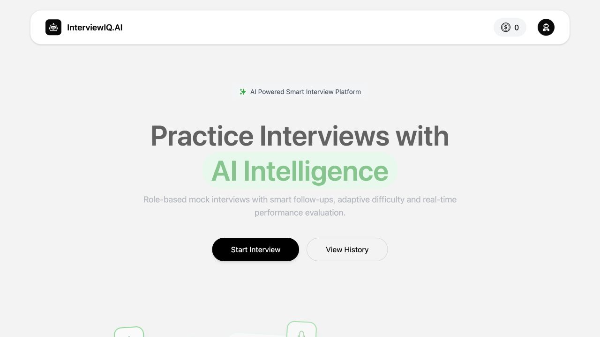
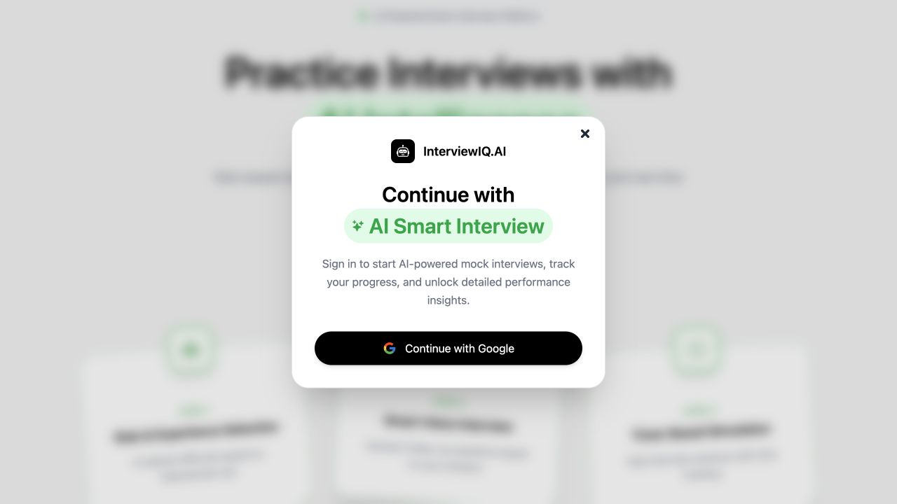
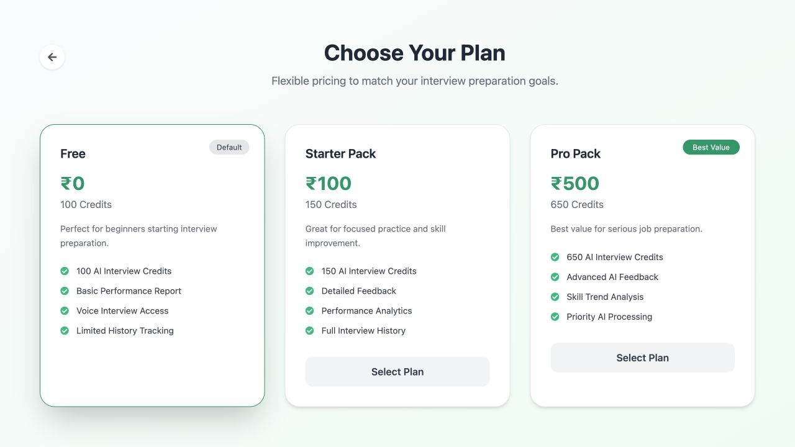

# InterviewIQ.AI

An AI-powered interview preparation platform that helps candidates practice HR and technical interviews, receive structured feedback, and track performance.


[Live Demo](https://interview-agent-x6kq.onrender.com/) · [Features](#features) · [Preview](#preview) · [Tech Stack](#tech-stack) · [Getting Started](#getting-started)

---

## Preview

| Experience | Highlights |
| --- | --- |
| Landing page | Clear entry point for starting an interview or viewing history |
| Interview setup | Role, experience, HR/Technical mode, and optional resume analysis |
| Interview session | Five AI-generated questions with voice interaction and timers |
| Analytics report | Overall score, skill evaluation, question feedback, and PDF export |
| Credit plans | Free, Starter, and Pro plans with Razorpay checkout |

### Landing page



### Authentication



### Pricing



---

## Tech Stack

### Backend — `server/`

- Node.js + Express 5
- MongoDB + Mongoose
- OpenRouter with `openai/gpt-4o-mini`
- Firebase Google sign-in with JWT cookie sessions
- Razorpay payment integration
- Multer and PDF.js for resume uploads and text extraction

### Frontend — `client/`

- React 19 + Vite 7
- Tailwind CSS 4
- React Router and Redux Toolkit
- Axios for API communication
- Recharts for performance visualization
- Motion for UI animation
- jsPDF and AutoTable for report generation

---

## Features

- **AI interview generation** — Creates role-aware five-question interviews with progressive difficulty.
- **Resume-based personalization** — Extracts skills and projects from a PDF resume to improve question relevance.
- **HR and technical modes** — Supports behavioral practice and role-specific technical interviews.
- **Voice and timed experience** — Uses browser speech synthesis, speech recognition where supported, interviewer video, and per-question timers.
- **Structured evaluation** — Scores confidence, communication, correctness, and overall performance.
- **Analytics and reports** — Shows score trends, question-level feedback, and downloadable PDF reports.
- **Interview history** — Stores previous interviews and makes reports available for review.
- **Credits and payments** — Supports free credits and paid Razorpay credit packs.

---

## Project Structure

```text
.
├── client/
│   └── src/
│       ├── components/       # Interview flow, reports, navbar, footer
│       ├── pages/            # Home, auth, interview, history, pricing
│       ├── redux/            # User state and Redux store
│       └── utils/            # Firebase configuration
│
└── server/
    ├── config/               # MongoDB and JWT configuration
    ├── controllers/          # Auth, interview, user, payment logic
    ├── middlewares/          # JWT auth and file upload handling
    ├── models/               # User, Interview, Payment schemas
    ├── routes/               # REST API routes
    └── services/             # OpenRouter and Razorpay integrations
```

---

## Getting Started

### Requirements

- Node.js 18+
- MongoDB
- Firebase project with Google sign-in enabled
- OpenRouter API key
- Razorpay credentials

### Install dependencies

```bash
cd server && npm install
cd ../client && npm install
```

### Backend environment

Create `server/.env`:

```env
MONGODB_URL=your_mongodb_url
JWT_SECRET=your_jwt_secret
OPENROUTER_API_KEY=your_openrouter_api_key
RAZORPAY_KEY_ID=your_razorpay_key_id
RAZORPAY_KEY_SECRET=your_razorpay_key_secret
PORT=8000
```

### Frontend environment

Create `client/.env`:

```env
VITE_FIREBASE_APIKEY=your_firebase_api_key
VITE_RAZORPAY_KEY_ID=your_razorpay_key_id
```

### Run the application

Start the backend and frontend in separate terminals:

```bash
cd server && npm run dev
cd client && npm run dev
```

Open [http://localhost:5173](http://localhost:5173).

---

## Backend API

| Route group | Purpose |
| --- | --- |
| `/api/auth` | Google authentication and logout |
| `/api/user` | Current-user and credit information |
| `/api/interview` | Resume analysis, question generation, answers, reports, and history |
| `/api/payment` | Razorpay order creation and payment verification |

## Engineering Highlights

- Full-stack React and Express architecture with persistent MongoDB data.
- AI used for both personalized question generation and structured answer evaluation.
- Resume parsing pipeline that extracts PDF text before AI processing.
- Server-side Razorpay signature verification for payment safety.
- Modular separation of pages, reusable components, controllers, routes, services, and models.
